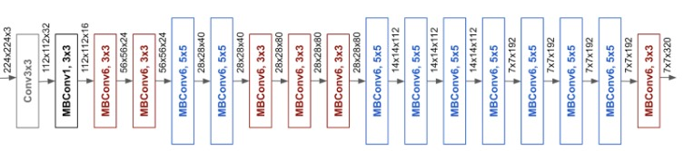
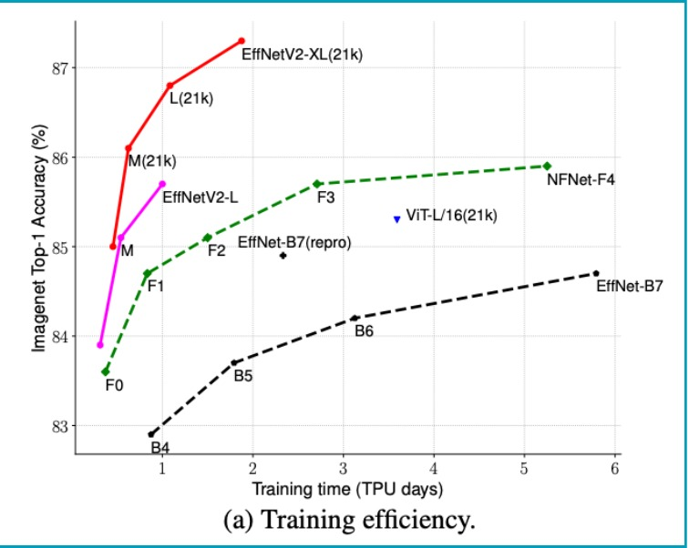
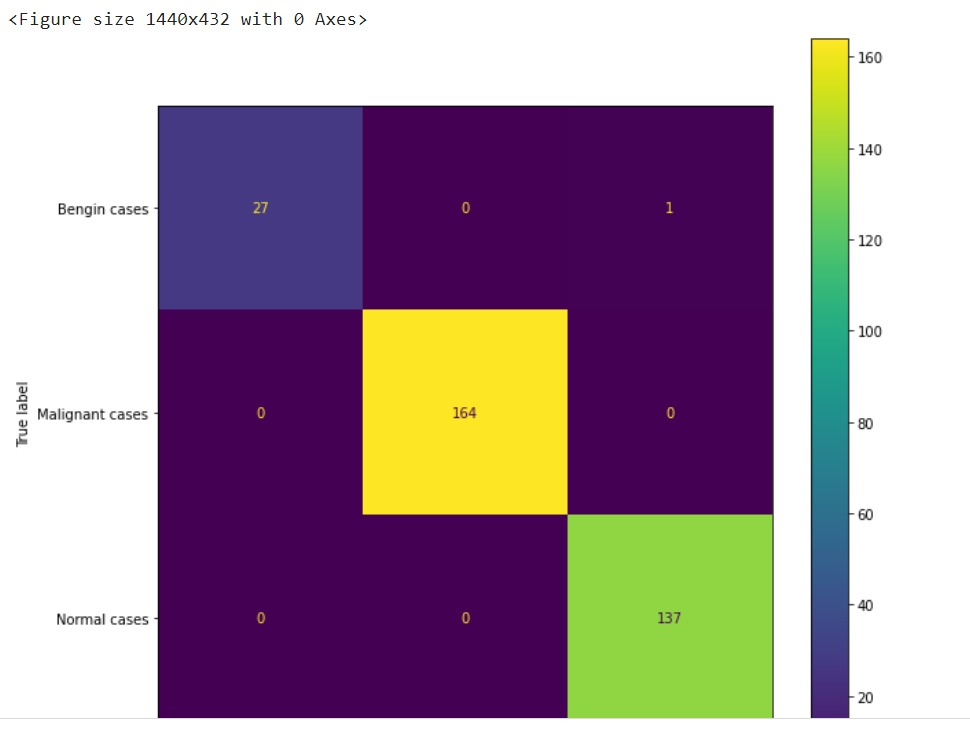
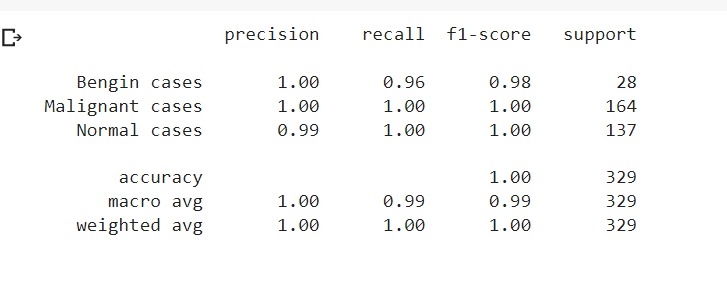

# Lung Cancer Detection and Tumor Percentage Estimation

## Technology Used
After the data processing and model selection, the next step is to choose a tech stack to work on the data and do image classification.We used  Python, Google’s Tensorflow, Pandas, and Sklearn. Python is our choice because it has a pretty great library base and community, especially in the Machine Learning/Deep Learning field. Our model is trained on Google’s Colaboratory platform.

## The Data

Data is obtained from the following source. The dataset contains 1190 images representing CT scan slices of 110 cases (see Figure 1). These cases are grouped into three classes: normal, benign, and malignant. of these, 40 cases are diagnosed as malignant; 15 cases are diagnosed as benign, and 55 cases are classified as normal. The CT scans were originally collected in DICOM format. The scanner used is SOMATOM from Siemens. CT protocol includes: 120 kV, slice thickness of 1 mm, with window width ranging from 350 to 1200 HU, and window center from 50 to 600 were used for reading. with breath-hold at full inspiration. Each image in the dataset is resized to a size of  224*224 pixels with a batch size of 32 images to maintain uniformity. This is the critical step to maintain consistency and faster data processing. 

==**Here is the soruce of dataset**== [The IQ-OTHNCCD lung cancer dataset](https://data.mendeley.com/datasets/bhmdr45bh2/1/)

## Model Selection

In supervised machine learning, given a training set — comprised of features (a.k.a inputs, independent variables) and labels (a.k.a. response, target, dependent variables), we use an algorithm to train a set of models with varying hyperparameter values then select the model that best minimizes some cost (a.k.a. loss, objective) function. We then use this model to make prediction on an unseen test set and evaluate the model's final performance.
It is common practice when performing a (supervised) machine learning experiment to hold out part of the available data as a test set. This way, we can evaluate how well the model will generalize to a new data set that was not seen during the training phase. In other words, this process tries to avoid the overfitting phenomenon where the algorithm starts memorizing the training set's labels but fail to predict anything for the unseen test data. 
Our data is divided into 70-30 (70 % for training and 30% for test )  train-test split. 
 
We chose to do Transfer Learning on our data since our dataset is small . It is a popular approach in deep learning where pre-trained models are used as the starting point on computer vision and natural language processing tasks given the vast compute and time resources required to develop neural network models on these problems and from the huge jumps in skill that they provide on related problems. According to Wikipedia, Transfer learning (TL) is a research problem in machine learning (ML) that focuses on storing knowledge gained while solving one problem and applying it to a different but related problem. For example, knowledge gained while learning to recognize cars could apply when trying to recognize trucks. This area of research bears some relation to the long history of psychological literature on the transfer of learning, although practical ties between the two fields are limited. From a practical standpoint, reusing or transferring information from previously learned tasks for the learning of new tasks has the potential to significantly improve the sample efficiency of a reinforcement learning agent. In simple words, Transfer learning is a machine learning method where a model developed for a task is reused as the starting point for a model on a second task. The approach of Transfer Learning we went with is Fine Tuning. Fine-tuning is a process that takes a model that has already been trained for one given task and then tunes or tweaks the model to make it perform a second similar task.
For Example, a model trained to identify fruits can be used to identify vegetables using fine-tuning. 
 
The model we chose to go as the base model is EfficientnetV2, specifically EfficientNetV2B0 as our base model. EfficientNetV2 are a family of image classification models, which achieve better parameter efficiency and faster training speed than prior arts. Built upon EfficientNetV1, our EfficientNetV2 models use neural architecture search (NAS) to jointly optimize the model size and training speed and are scaled up in a way for faster training and inference speed. 

**Architecture of EfficientNetV2**

Architecturally the main differences are:

* EfficientNetV2 extensively uses both MBConv and the newly added fused-MBConv in the early layers.
* EfficientNetV2 prefers smaller expansion ratio for MBConv since smaller expansion ratios tend to have less memory access overhead.
* EfficientNetV2 prefers smaller 3x3 kernel sizes, but it adds more layers to compensate for the reduced receptive field resulting from the smaller kernel size.
* EfficientNetV2 completely removes the last stride-1 stage in the original EfficientNet, perhaps due to its large parameter size and memory access overhead.

We unfreeze all the layers of the EfficientNetV2B0 model and added two extra layers before the final output layer. The layers are a 2 Dimensional Global Average Pooling layer and a Dense Layer with 100 neurons. The reason to unfreeze all the layers is that our base model is trained on the ImageNet database, which is a very large collection of human-annotated photographs designed by academics for developing computer vision algorithms which is different than an X-ray image of a lung so the model’s weights should be relearned based on our data. The output layer classifies three classes: Malignant (cancerous tumor), Benign, and Normal.

## Results

After performing the above-mentioned procedures, we are successfully created a highly accurate model, with the efficiency of 99.7% (based on the accuracy matrix) with an error of 0.049. The confusion matrix is given below of the particular dataset we have used

**Confusion Matrix**

From this confusion matrix, it is highly evident that our model categorizes well in malignant (cancerous tumor ) cases which is very important in this study so that lives can be saved. Other categories are also predicted with high accuracy on the given test dataset.

The complete break down of the performance of our model is given below

**Classification Report**

This study is performed on a dataset consisting of 1119 images which is very less to make a clear verdict on whether this model can perform well in real-world scenarios. So the trials should be made to verify the worthiness of the model.

## Segmenation (Morphological analyais)

We will be updating it later.